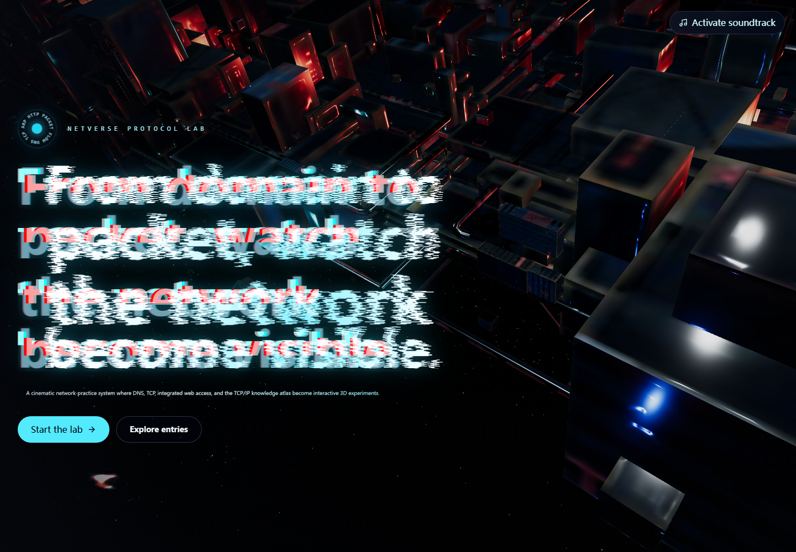
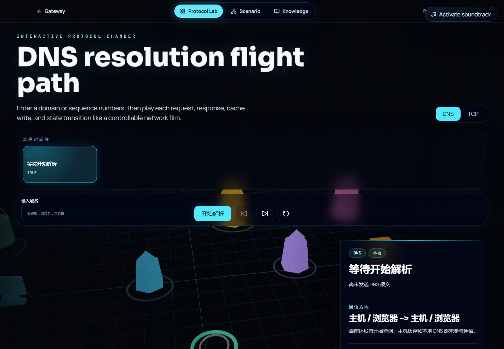
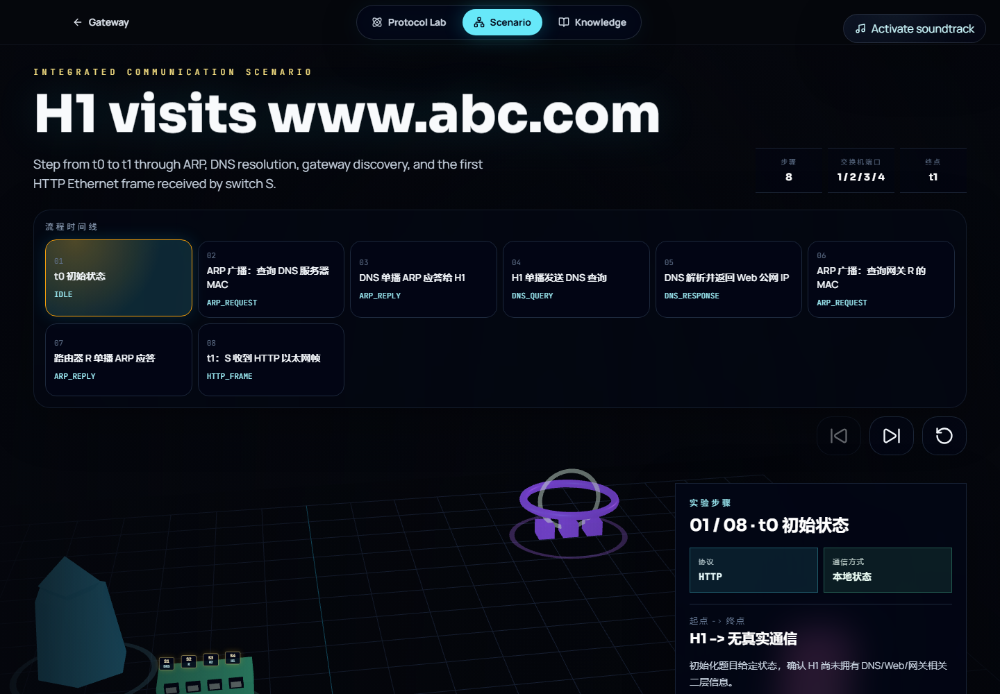
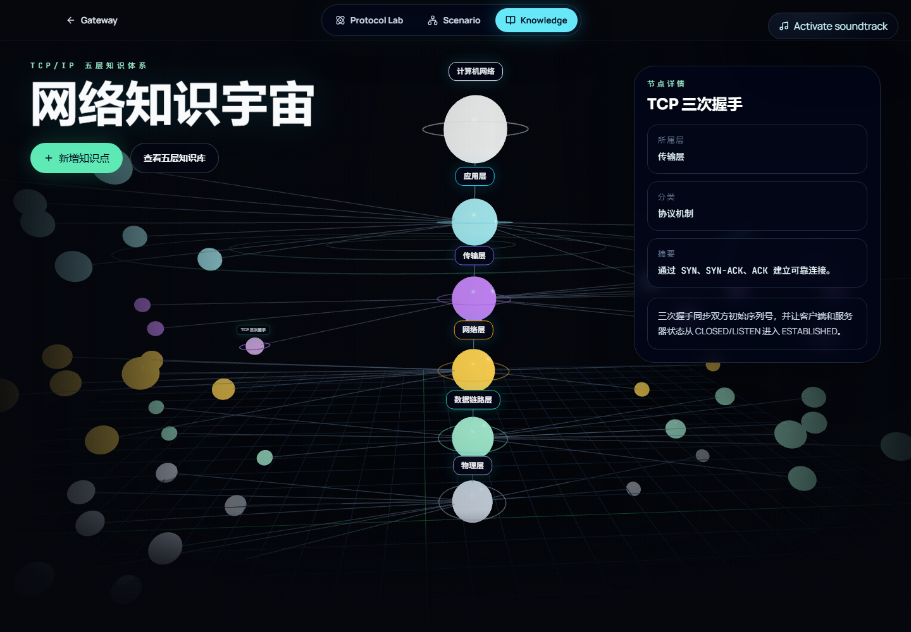

# NetVerse Protocol Lab

NetVerse Protocol Lab 是一个面向《计算机网络》课程实训的交互式网络原理展示系统。项目围绕单项协议可视化、综合网络场景模拟、TCP/IP 五层知识体系学习三个部分展开，通过 React 3D 场景、步骤播放、状态表更新和 Spring Boot 后端接口展示网络通信过程。

## 功能概览

- **Protocol Lab**
  - DNS 域名解析流程可视化。
  - 展示主机缓存、本地 DNS 缓存、缓存命中/未命中和解析结果。
  - TCP 三次握手与四次挥手可视化。
  - 展示 SYN、ACK、FIN 报文传递和 TCP 状态变化。

- **Network Scenario**
  - 模拟 H1 从 `t0` 访问 `www.abc.com`，直到交换机 S 在 `t1` 首次收到封装 HTTP 请求报文的以太网帧。
  - 展示 ARP、DNS、TCP/HTTP 相关阶段。
  - 展示每步起点/终点、协议、广播/单播、源/目的 MAC、源/目的 IP、拓扑路径、交换机处理行为。
  - 动态展示 H1 ARP 表和交换机 S MAC 表。

- **Knowledge Atlas**
  - TCP/IP 五层模型知识体系展示。
  - 支持知识点新增、修改、删除、模糊查询、分页和详情查看。
  - 提供 3D 知识图谱，展示层、协议、设备、技术和知识点之间的层次关系。
  - 知识点和知识图谱层级关系持久化到 MySQL。

## 技术栈

- 前端：React、Vite、TypeScript、Tailwind CSS、React Three Fiber、Drei、GSAP
- 后端：Spring Boot、Spring Web、Spring Data JPA、Flyway、Maven
- 数据库：MySQL 8
- 开发运行：Docker Compose 可选，用于启动 MySQL

## 项目结构

```text
frontend/                 React + Vite 前端
backend/                  Spring Boot 后端
docs/sql/                 数据库建表和种子数据脚本
docs/screenshots/         项目运行截图
docker-compose.yml        MySQL Docker 开发环境
.env.example              本地环境变量示例
```

## 环境要求

- Node.js 20 或以上
- JDK 17
- Maven 3.9 或以上
- MySQL 8
- Docker Desktop（可选，用于运行 MySQL）

## 配置说明

仓库不会提交真实数据库密码。运行项目前，用户应根据自己的本地环境创建 `.env` 或设置系统环境变量。

可以先复制示例文件：

```powershell
Copy-Item .env.example .env
```

然后按自己的 MySQL 配置修改 `.env`。`.env` 已被 `.gitignore` 忽略，不应提交到 GitHub。

主要配置项：

```text
NETVERSE_SERVER_PORT          后端服务端口，默认 18083
NETVERSE_MYSQL_PORT           Docker MySQL 映射到宿主机的端口，默认 3307
NETVERSE_MYSQL_DATABASE       数据库名，默认 netverse_lab
NETVERSE_MYSQL_ROOT_PASSWORD  Docker MySQL root 密码，由用户本地填写
NETVERSE_DB_URL               Spring Boot 连接 MySQL 的 JDBC 地址
NETVERSE_DB_USERNAME          Spring Boot 数据库用户名
NETVERSE_DB_PASSWORD          Spring Boot 数据库密码，由用户本地填写
VITE_API_BASE_URL             前端请求后端 API 的基础地址，默认 http://127.0.0.1:18083
```

配置文件位置：

- 后端端口和数据库连接默认值：`backend/src/main/resources/application.yml`
- Docker MySQL 端口和初始化数据库：`docker-compose.yml`
- 前端 API 地址默认值：`frontend/src/api/netverseApi.ts`
- 本地环境变量示例：`.env.example`

后端启动时会自动尝试读取项目根目录 `.env`：

```text
backend/src/main/resources/application.yml
```

因此在常规本地开发中，可以让 Docker Compose、Spring Boot 后端和 Vite 前端共用同一个 `.env`。真实 `.env` 不会提交到 GitHub。

## 启动方式

### 1. 启动 MySQL

方式一：使用本机已有 MySQL。

先创建数据库：

```sql
CREATE DATABASE netverse_lab DEFAULT CHARACTER SET utf8mb4 COLLATE utf8mb4_unicode_ci;
```

然后设置环境变量，让后端连接到你的 MySQL：

```powershell
$env:NETVERSE_DB_URL='jdbc:mysql://localhost:3306/netverse_lab?useUnicode=true&characterEncoding=utf8&serverTimezone=Asia/Shanghai&allowPublicKeyRetrieval=true&useSSL=false'
$env:NETVERSE_DB_USERNAME='root'
$env:NETVERSE_DB_PASSWORD='your-local-password'
```

方式二：使用 Docker Compose 启动 MySQL。

先创建 `.env` 并填写 `NETVERSE_MYSQL_ROOT_PASSWORD` 和 `NETVERSE_DB_PASSWORD`：

```powershell
Copy-Item .env.example .env
```

然后启动：

```powershell
docker compose up -d mysql
```

Docker 方式默认把容器内 MySQL `3306` 映射到宿主机 `3307`，可通过 `.env` 中的 `NETVERSE_MYSQL_PORT` 修改。

如果 MySQL 容器已经初始化过，后续修改 `.env` 中的 `NETVERSE_MYSQL_ROOT_PASSWORD` 不会自动修改已有数据卷里的 root 密码。应保持 `.env` 和当前数据库密码一致，或在确认不需要旧数据时重建数据库卷。

### 2. 启动后端

```powershell
cd backend
$env:JAVA_HOME='D:\jdk-17.0.16'
$env:Path="$env:JAVA_HOME\bin;$env:Path"
mvn spring-boot:run
```

如果使用 IDEA，可以直接运行 `NetVerseProtocolLabApplication`。项目提供了 `backend/.mvn/` 下的 Maven 配置，用于绕开本机可能存在的私有 Maven 仓库配置；后端会自动读取根目录 `.env` 中的数据库连接信息。

后端默认地址：

```text
http://127.0.0.1:18083
```

健康检查：

```text
GET http://127.0.0.1:18083/api/health
```

如果需要改后端端口：

```powershell
$env:NETVERSE_SERVER_PORT='18084'
```

### 3. 启动前端

```powershell
cd frontend
npm install
npm run dev
```

前端默认地址：

```text
http://127.0.0.1:5173
```

如果后端端口改了，需要同步设置前端 API 地址：

```powershell
$env:VITE_API_BASE_URL='http://127.0.0.1:18084'
npm run dev
```

## 主要接口

```text
POST   /api/dns/resolve
POST   /api/dns/commit
GET    /api/dns/cache
GET    /api/dns/host-cache
DELETE /api/dns/cache
DELETE /api/dns/host-cache

POST   /api/tcp/handshake
POST   /api/tcp/release

POST   /api/scenarios/web-visit

GET    /api/knowledge/points
POST   /api/knowledge/points
PUT    /api/knowledge/points/{id}
DELETE /api/knowledge/points/{id}
GET    /api/knowledge/graph
```

## 数据库说明

数据库迁移脚本位于：

```text
backend/src/main/resources/db/migration/
```

同时在 `docs/sql/` 中提供了建表和初始化数据脚本：

```text
docs/sql/schema.sql
docs/sql/seed.sql
```

后端启动时 Flyway 会自动执行迁移脚本，创建 DNS 记录、DNS 缓存、主机 DNS 缓存、知识点、协议日志等相关表。

主要持久化内容：

```text
knowledge_point       TCP/IP 五层知识点
knowledge_relation    知识图谱层级关系，例如 root -> 应用层、应用层 -> DNS
dns_record            DNS 示例记录
dns_cache             本地 DNS 解析器缓存
host_dns_cache        主机侧 DNS 缓存
simulation_log        协议模拟操作日志
```

## 页面截图

### 首页



### Protocol Lab



### Network Scenario



### Knowledge Atlas



## 构建检查

前端构建：

```powershell
cd frontend
npm run build
```

后端编译：

```powershell
cd backend
$env:JAVA_HOME='D:\jdk-17.0.16'
$env:Path="$env:JAVA_HOME\bin;$env:Path"
mvn -DskipTests compile
```

## 说明

本项目不是实现真实 DNS、TCP 或交换机设备，而是以协议脚本引擎和可视化方式模拟课程要求中的协议流程、网络状态变化和知识体系交互，便于学习和演示计算机网络核心原理。
